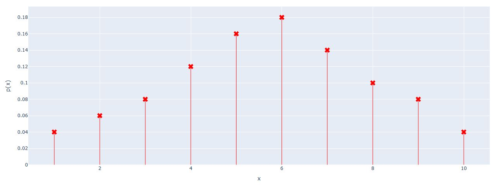

# Plot PMF with Plotly

A simple Python function for plotting a **Probability Mass Function (PMF)** of a discrete random variable using [Plotly](https://plotly.com/python/).

## Features

* Plot a discrete probability distribution as a line chart.
* Display probability values for each possible value of the random variable.
* Customize the line color.
* Customize the marker symbol.
* Validate that the sum of probabilities is equal to 1.

## Installation

First, install Plotly:

```bash
pip install plotly
```
from math import isclose

## Usage

Import the function and provide:

* `x`: Values of the discrete random variable.
* `y`: Probability corresponding to each value of `x`.
* `color_line`: Color of the PMF line.
* `marker_symbol`: Marker symbol used for each probability.

### Example

```
import plotly.graph_objects as go
from math import isclose

fig = go.Figure()

x = [1, 2, 3, 4, 5, 6,7,8,9,10]
p_x = [0.04,0.06,0.08,0.12,0.16,0.18,0.14,0.10,0.08,0.04]

fig= plot_PMF(fig,x,p_x,"red","x")


fig.update_yaxes(title_text="p(x)")
fig.update_xaxes(title_text="x")

fig.show()
fig.write_html('first_figure1.html', auto_open=True)
```
## Example Output



## Probability Validation

The probabilities in `y` should form a valid probability distribution.

Therefore:

```python
sum(y) = 1
```
